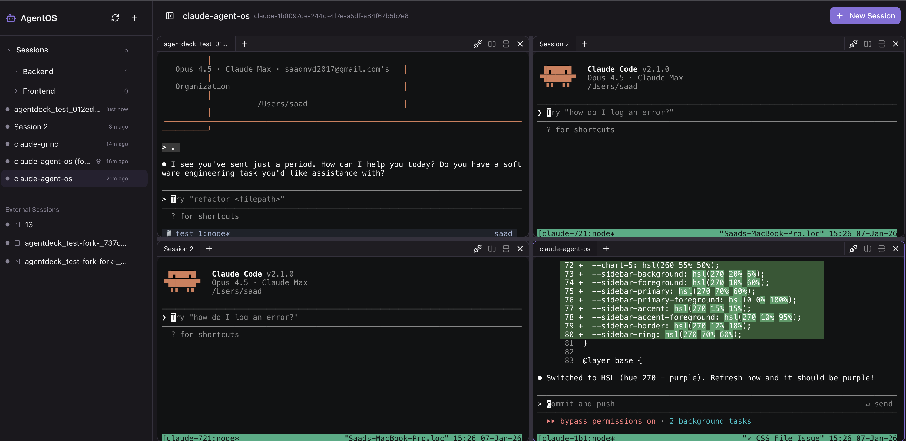

# AgentOS

A self-hosted web UI for managing multiple AI coding assistant sessions with multi-pane terminals, session groups, and conversation forking.

> If you find AgentOS useful, please consider giving it a star! It helps the project grow and reach more developers.



## Supported Agents

- **Claude Code** (Anthropic) - Full support with resume/fork
- **Codex** (OpenAI) - Basic support with approval modes
- **OpenCode** - Basic support for multi-provider CLI
- **Gemini CLI** (Google) - Basic support for Gemini models
- **Aider** - AI pair programming with multi-LLM support
- **Cursor CLI** - Cursor's AI agent in the terminal

## Features

- **Multi-Agent Support** - Switch between Claude, Codex, OpenCode, Gemini, Aider, and Cursor per session
- **Multi-Pane View** - Run up to 4 sessions side-by-side with resizable panes
- **Session Groups** - Organize sessions in collapsible folder hierarchy
- **Tabbed Terminals** - Multiple tabs per pane for quick switching
- **Session Forking** - Fork conversations to explore different approaches (Claude)
- **Session Resume** - Auto-detects session IDs for seamless resume (Claude)
- **Status Detection** - Real-time running/waiting/idle status with spike filtering
- **Browser Notifications** - Get notified when sessions need input, click to activate
- **Git Worktrees** - Isolated branches for parallel feature development
- **Auto Environment Setup** - Copies `.env` files, installs dependencies automatically
- **Dev Server Ports** - Each worktree gets a unique port (3100, 3110, 3120...)
- **PR Integration** - Create PRs and track status directly from the UI (requires `gh` CLI)
- **Skip Permissions** - Optional flag to bypass permission prompts
- **External Session Import** - Import existing tmux sessions
- **Mobile Responsive** - Touch-friendly interface with collapsible sidebar
- **tmux Integration** - Sessions persist across page reloads
- **Session Orchestration** - Spawn worker sessions with isolated worktrees via MCP

## Prerequisites

- Node.js 20+
- tmux
- At least one of:
  - [Claude Code CLI](https://github.com/anthropics/claude-code) installed and authenticated
  - [Codex CLI](https://github.com/openai/codex) installed and authenticated
  - [OpenCode CLI](https://github.com/opencode-ai/opencode) installed and configured
  - [Gemini CLI](https://github.com/google-gemini/gemini-cli) installed and authenticated
  - [Aider](https://aider.chat/) installed and configured
  - [Cursor CLI](https://cursor.com/cli) installed (requires Cursor subscription)
- [GitHub CLI](https://cli.github.com/) (`gh`) - Optional, for PR integration
- macOS or Linux

## Quick Start

```bash
# Clone the repository
git clone https://github.com/saadnvd1/agent-os
cd agent-os

# Install dependencies
npm install

# Start development server
npm run dev

# Open http://localhost:3011
```

## How It Works

AgentOS manages AI coding CLI sessions through tmux. Each session runs in its own tmux session (`{agent}-{uuid}`), allowing:

- **Persistence** - Sessions survive browser refreshes and server restarts
- **Resume** - Pick up conversations where you left off (Claude: `--resume`)
- **Fork** - Branch conversations using `--fork-session` (Claude only)
- **Multi-Agent** - Choose between Claude, Codex, OpenCode, Gemini, Aider, or Cursor when creating sessions

The web UI provides an xterm.js terminal connected to tmux, with a sidebar for session management. Provider-specific flags are handled automatically via the abstraction in `lib/providers.ts`.

## Git Worktrees

When creating a session in a git repository, you can enable "Create isolated worktree" to:

1. **Create a feature branch** - Automatically generates `feature/{name}` branch
2. **Isolated directory** - Worktree created in `~/.agent-os/worktrees/`
3. **Auto-setup environment** - Copies `.env*` files and runs package manager install
4. **Unique dev port** - Each worktree gets assigned a port (3100, 3110, etc.)
5. **PR workflow** - Create PRs directly from the session menu

### Configuration (Optional)

Create `.agent-os/worktrees.json` in your project to customize setup:

```json
{
  "setup": [
    "cp $ROOT_WORKTREE_PATH/.env.local .env.local",
    "pnpm install",
    "npm run db:migrate"
  ],
  "devServer": {
    "command": "npm run dev",
    "portEnvVar": "PORT"
  }
}
```

Without a config file, AgentOS auto-detects your package manager and copies `.env*` files automatically.

## Architecture

```
Browser (React 19)
├── PaneLayout (resizable panels)
│   └── Pane (tabs + terminal)
├── SessionList (grouped sidebar)
└── Terminal (xterm.js)
         │
         │ WebSocket (/ws/terminal)
         ▼
server.ts (Next.js + node-pty)
         │
         ▼
tmux sessions → AI CLI (claude/codex/opencode)
         │
         ▼
SQLite (sessions, groups, agent_type)
```

## Scripts

- `npm run dev` - Start development server
- `npm run build` - Build for production
- `npm start` - Run production server
- `npm run typecheck` - TypeScript type checking

## Tech Stack

- **Framework**: Next.js 15 + React 19
- **Language**: TypeScript
- **Database**: SQLite (better-sqlite3)
- **Terminal**: xterm.js + node-pty
- **Panels**: react-resizable-panels
- **Styling**: Tailwind CSS 4 + shadcn/ui

## Configuration

Environment variables (optional):

- `PORT` - Server port (default: 3011)
- `DB_PATH` - SQLite database path (default: ./agent-os.db)

## License

MIT
