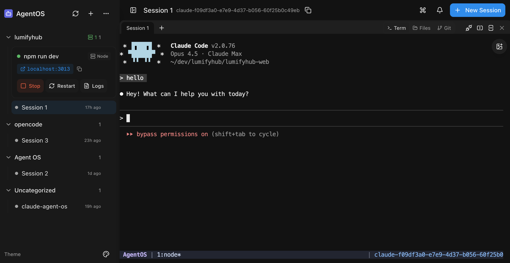

# AgentOS

A mobile-first web UI for managing AI coding sessions.

[](https://discord.gg/cSjutkCGAh)

https://github.com/user-attachments/assets/0e2e66f7-037e-4739-99ec-608d1840df0a



## Installation

### Via npm (Recommended)

If you already have Node.js 20+ installed:

```bash
# Install globally
npm install -g @saadnvd1/agent-os

# Run setup (checks/installs tmux, ripgrep, builds app)
agent-os install

# Start the server
agent-os start
```

### Via curl (Installs everything)

For fresh installs without Node.js:

```bash
curl -fsSL https://raw.githubusercontent.com/saadnvd1/agent-os/main/scripts/install.sh | bash
agent-os start
```

### Desktop App

Download native desktop apps from [Releases](https://github.com/saadnvd1/agent-os/releases):

- macOS (Apple Silicon): `.dmg`
- Linux: `.deb` or `.AppImage`

> **Note:** The desktop app is a native wrapper around the web UI. You still need to install and run AgentOS (via the installer script above) for the backend server. The desktop app just provides a convenient native window instead of using your browser.

> **Don't want to self-host?** Try [AgentOS Cloud](https://runagentos.com) - pre-configured cloud VMs for AI coding.

### Manual Install

```bash
git clone https://github.com/saadnvd1/agent-os
cd agent-os
npm install
npm run dev  # http://localhost:3011
```

### Prerequisites

- Node.js 20+
- tmux
- [ripgrep](https://github.com/BurntSushi/ripgrep) (for code search - auto-installed by installer script, or run `agent-os update`)
- At least one AI CLI: [Claude Code](https://github.com/anthropics/claude-code), [Codex](https://github.com/openai/codex), [OpenCode](https://github.com/anomalyco/opencode), [Kilo Code CLI](https://kilo.ai/docs/cli), [Gemini CLI](https://github.com/google-gemini/gemini-cli), [Aider](https://aider.chat/), or [Cursor CLI](https://cursor.com/cli)

## Supported Agents

| Agent       | Resume | Fork | Auto-Approve                     |
| ----------- | ------ | ---- | -------------------------------- |
| Claude Code | ✅     | ✅   | `--dangerously-skip-permissions` |
| Codex       | ❌     | ❌   | `--approval-mode full-auto`      |
| OpenCode    | ❌     | ❌   | Config file                      |
| Kilo Code   | ✅     | ✅   | Config file                      |
| Gemini CLI  | ❌     | ❌   | `--yolomode`                     |
| Aider       | ❌     | ❌   | `--yes`                          |
| Cursor CLI  | ❌     | ❌   | N/A                              |
| Amp         | ❌     | ❌   | `--dangerously-allow-all`        |
| Pi          | ❌     | ❌   | N/A                              |
| Oh My Pi    | ❌     | ❌   | N/A                              |

## Features

- **Mobile-first** - Full functionality from your phone, not a dumbed-down responsive view
- **Voice-to-text** - Dictate prompts to your coding sessions hands-free
- **Multi-pane layout** - Run up to 4 sessions side-by-side
- **tmux by default** - Every session lives in tmux, so closing the browser never kills your work
- **Multiple machines** - Run sessions on any machine you can reach with ssh keys, side by side with local ones
- **Session discovery** - tmux sessions you started yourself, on any machine, show up under the project whose folder they run in
- **Code search** - Fast codebase search with syntax-highlighted results (Cmd+K)
- **File picker** - Browse and attach files to sessions, with direct upload from mobile
- **Clone from GitHub** - Clone repos directly from the UI when creating projects
- **Git integration** - Status, diffs, commits, PRs from the UI
- **Git worktrees** - Isolated branches with auto-setup
- **Dev servers** - Start/stop Node.js and Docker servers
- **Session orchestration** - Conductor/worker model via MCP

## Chat

Sessions open as a chat by default: streaming replies, tool calls folded into
expandable steps, inline diffs for edits, a plan checklist, image attachments
and a Stop button, all readable on a phone. Chat drives the same agent as the
terminal (Claude Code through the Agent SDK, with your own Claude login and
full access, like running it with permissions skipped). The **Chat /
Terminal** switch in the tab bar hands the same conversation between the two:
the terminal resumes it with `claude --resume`, and switching back closes the
terminal so only one side drives it. History is kept in AgentOS and survives
restarts.

Chat runs on this machine; sessions on other machines use the terminal.
Drivers for other agent CLIs plug into `lib/chat/drivers`.

## Tasks

Hand off work and keep going. **Tasks → New task** takes a project and a
prompt. AgentOS creates a git worktree and branch, starts Claude there in tmux
with a brief to finish by pushing and opening a pull request, and tracks it:
Working, Needs input, Blocked, Ready for review, Checks failing or Agent
exited. **Sign off & merge** squash-merges the PR (refused while CI is failing
or pending), then removes the session, worktree and branches. **Drop** closes
the PR and removes everything. Agents never merge their own work.

Requires the GitHub CLI (`gh`) signed in, and a project with a GitHub remote.

## Agent network

Sessions started by AgentOS can find and talk to each other without you,
through the `aos` command on their PATH (any agent CLI can use it; Claude is
also briefed on it):

```bash
aos peers                         # sessions, their project, what each is doing
aos send <session> "message"      # wakes the other session with the message
aos inbox                         # read messages sent to you
aos history <session>             # your conversation with a session
aos spawn <project> "prompt"      # start a new agent session in a project
aos task <project> "prompt"       # start a background task that ends in a PR
```

Messages are delivered by typing them into the recipient's terminal, labelled
as coming from another agent, and a rate limit stops two agents looping. The
**Messages** panel shows every conversation and lets you message any session.
Sessions on other machines can receive messages but not yet send them.

## Workspaces

Group projects into workspaces (e.g. Work, Personal) from the **+** menu.
Each workspace is a collapsible sidebar section showing how many sessions need
you; move a project in from its menu. Deleting a workspace keeps its projects.

## Machines

Open the sidebar menu (⋯) → **Machines** and add one with a name and an ssh
target (`user@host` or an alias from `~/.ssh/config`). Requirements: key-based
ssh from the machine running AgentOS (no password prompts), and tmux on the
remote machine. **Test connection** checks both.

New projects can then pick a machine. Their sessions run in tmux there and
attach over one reused ssh connection per machine. Folders match across
machines relative to `~`, so `~/dev/app` on your laptop and on a server are
the same project.

On other machines, files, git, worktrees, dev servers and summarize are not
available yet; the terminal, status, rename and send-keys are.

## Security

AgentOS has no login: whoever can reach it gets a terminal as you. So by
default it listens only on localhost and your Tailscale address, never on
Wi-Fi or other networks, and it refuses:

- requests addressed to any other host name (DNS rebinding), and
- API calls or terminal connections made by another website's page.

Reach it from your phone over Tailscale. To listen elsewhere, set
`AGENTOS_BIND` (e.g. `0.0.0.0`) and put your own authentication in front of
it; `AGENTOS_ALLOWED_HOSTS` adds host names it should answer to.

## Development

```bash
npm run dev          # http://localhost:3011
npm test             # vitest
npm run lint         # eslint
npm run check        # typecheck, lint, format and tests: what CI runs
```

A pre-commit hook formats and lints staged files, then typechecks and runs the
tests. CI runs `scripts/check --build` on every pull request and push to main.

## CLI Commands

```bash
agent-os run       # Start and open browser
agent-os start     # Start in background
agent-os stop      # Stop server
agent-os status    # Show URLs
agent-os logs      # Tail logs
agent-os update    # Update to latest
```

## Mobile Access

Use [Tailscale](https://tailscale.com) for secure access from your phone:

1. Install Tailscale on your dev machine and phone
2. Sign in with the same account
3. Access `http://100.x.x.x:3011` from your phone

## Documentation

For configuration and advanced usage, see the [docs](https://www.runagentos.com/docs).

## Related Projects

- **[aTerm](https://github.com/saadnvd1/aTerm)** - A Tauri-based desktop terminal workspace for AI-assisted coding. While AgentOS is a mobile-first web UI, aTerm is a native desktop app with multi-pane layouts optimized for running AI coding agents (Claude Code, Aider, OpenCode) alongside shells, dev servers, and a built-in git panel. Choose AgentOS for mobile access and browser-based workflows, or aTerm for a native desktop terminal experience.
- **[LumifyHub](https://lumifyhub.io)** - Team collaboration platform with real-time chat and structured documentation. Useful alongside AgentOS for coordinating multi-agent work across a team — share session context, document architectural decisions from coding sessions, and track progress across parallel agent workflows.

## License

MIT License - Free and open source.

See [LICENSE](LICENSE) for full terms.
