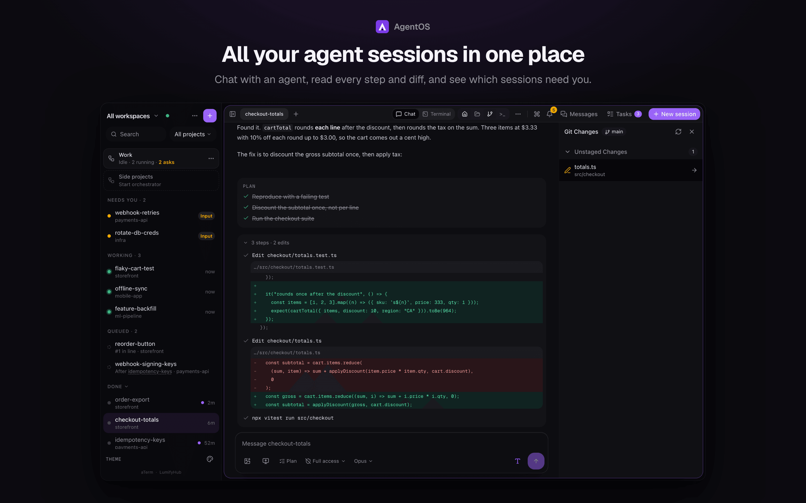
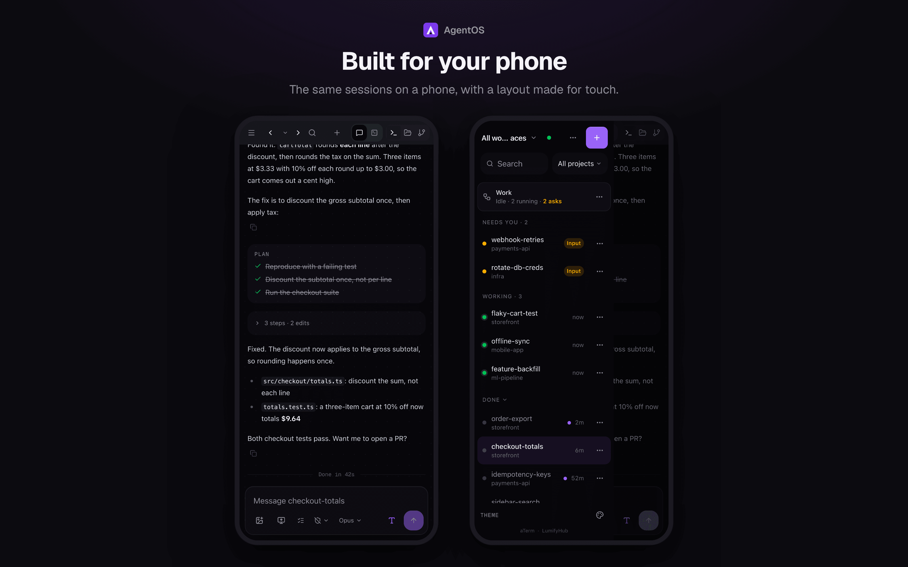
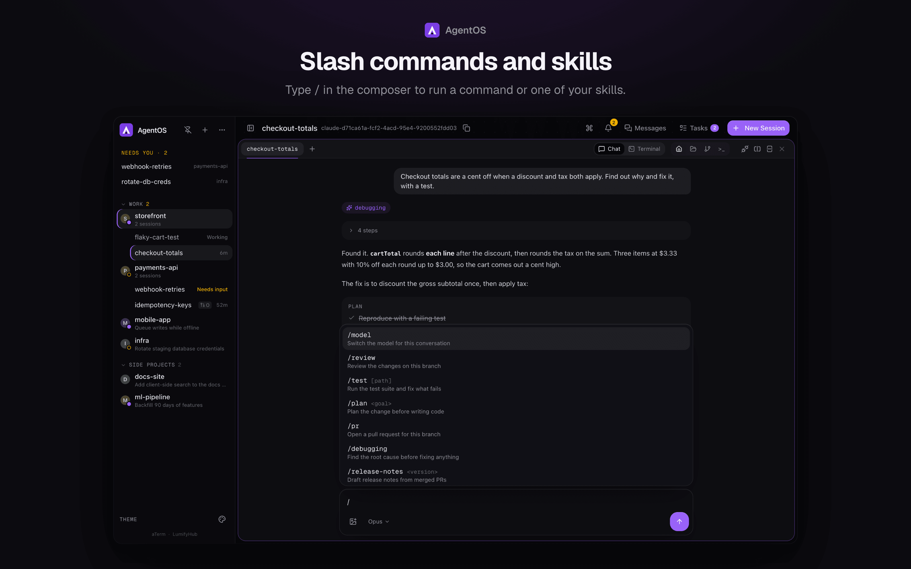
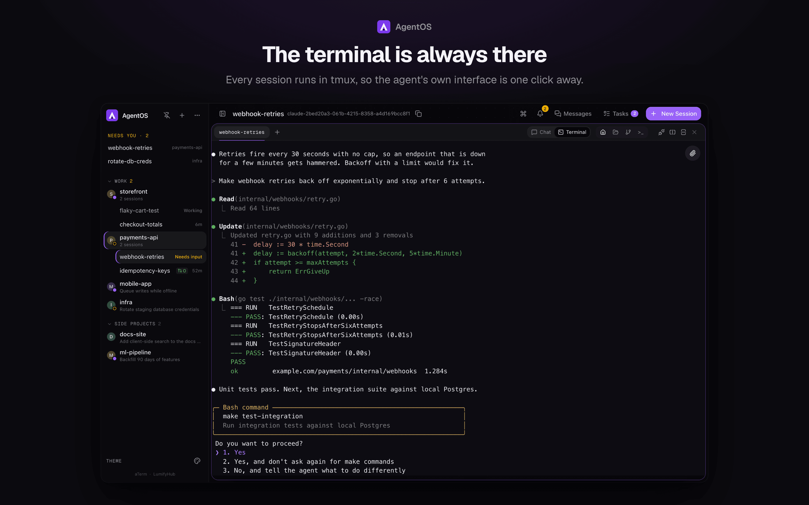
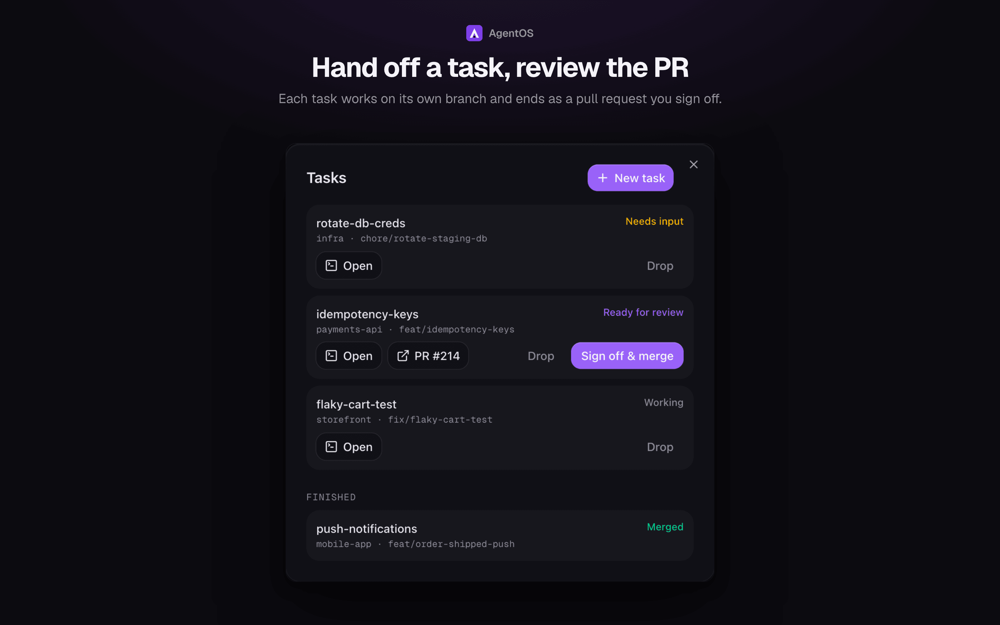
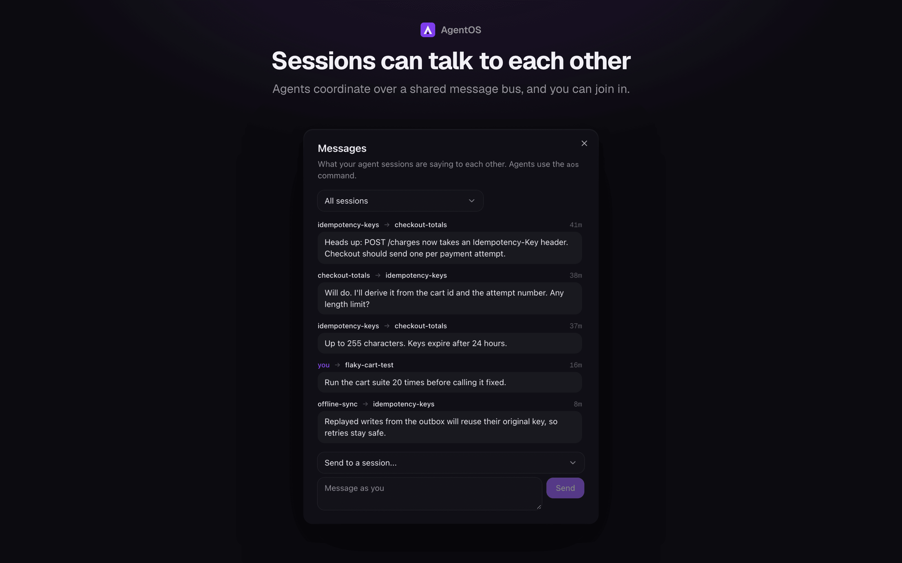

# AgentOS

A self-hosted, mobile-first home for your AI coding agents. Run Claude Code,
Codex, Gemini CLI and others side by side, chat with them or drop into their
terminal, hand off tasks that end in a pull request, and check on all of it
from your phone.

<picture>
  <source media="(prefers-color-scheme: light)" srcset="screenshots/hero-light.png">
  
</picture>



Demo video: https://github.com/user-attachments/assets/0e2e66f7-037e-4739-99ec-608d1840df0a

## Installation

### Via npm (Recommended)

If you already have Node.js 20+ installed:

```bash
# Install globally
npm install -g @saadnvd1/agent-os

# Run setup (checks/installs tmux, ripgrep, builds app)
agent-os install

# Start the server
agent-os start
```

### Via curl (Installs everything)

For fresh installs without Node.js:

```bash
curl -fsSL https://raw.githubusercontent.com/saadnvd1/agent-os/main/scripts/install.sh | bash
agent-os start
```

### Desktop App

Download native desktop apps from [Releases](https://github.com/saadnvd1/agent-os/releases):

- macOS (Apple Silicon): `.dmg`
- Linux: `.deb` or `.AppImage`

> **Note:** The desktop app is a native wrapper around the web UI. You still need to install and run AgentOS (via the installer script above) for the backend server. The desktop app just provides a convenient native window instead of using your browser.

> **Don't want to self-host?** Try [AgentOS Cloud](https://runagentos.com) - pre-configured cloud VMs for AI coding.

### Manual Install

```bash
git clone https://github.com/saadnvd1/agent-os
cd agent-os
npm install
npm run dev  # http://localhost:3011
```

### Prerequisites

- Node.js 20+
- tmux
- [ripgrep](https://github.com/BurntSushi/ripgrep) (for code search - auto-installed by installer script, or run `agent-os update`)
- At least one AI CLI: [Claude Code](https://github.com/anthropics/claude-code), [Codex](https://github.com/openai/codex), [OpenCode](https://github.com/anomalyco/opencode), [Kilo Code CLI](https://kilo.ai/docs/cli), [Gemini CLI](https://github.com/google-gemini/gemini-cli), [Aider](https://aider.chat/), or [Cursor CLI](https://cursor.com/cli)

## Supported Agents

| Agent       | Resume | Fork | Auto-Approve                     |
| ----------- | ------ | ---- | -------------------------------- |
| Claude Code | ✅     | ✅   | `--dangerously-skip-permissions` |
| Codex       | ❌     | ❌   | `--approval-mode full-auto`      |
| OpenCode    | ❌     | ❌   | Config file                      |
| Kilo Code   | ✅     | ✅   | Config file                      |
| Gemini CLI  | ❌     | ❌   | `--yolomode`                     |
| Aider       | ❌     | ❌   | `--yes`                          |
| Cursor CLI  | ❌     | ❌   | N/A                              |
| Amp         | ❌     | ❌   | `--dangerously-allow-all`        |
| Pi          | ❌     | ❌   | N/A                              |
| Oh My Pi    | ❌     | ❌   | N/A                              |

## Features

- **Mobile-first** - Full functionality from your phone, not a dumbed-down responsive view
- **Voice-to-text** - Dictate prompts to your coding sessions hands-free
- **Multi-pane layout** - Run up to 4 sessions side-by-side
- **tmux by default** - Every session lives in tmux, so closing the browser never kills your work
- **Multiple machines** - Run sessions on any machine you can reach with ssh keys, side by side with local ones
- **Session discovery** - tmux sessions you started yourself, on any machine, show up under the project whose folder they run in
- **Command palette** - ⌘K (or the search button on a phone) finds any session and every action: new session, workspaces, orchestrator, plan mode, compact, Usage, Devices, Archived, theme, stop the turn
- **Code search** - Fast codebase search with syntax-highlighted results (from the palette)
- **File picker** - Browse and attach files to sessions, with direct upload from mobile
- **Clone from GitHub** - Clone repos directly from the UI when creating projects
- **Git integration** - Status, diffs, commits, PRs from the UI
- **Git worktrees** - Isolated branches with auto-setup
- **Dev servers** - Start/stop Node.js and Docker servers
- **Session orchestration** - Conductor/worker model via MCP

## Chat

Sessions open as a chat by default: streaming replies, tool calls folded into
expandable steps, inline diffs for edits, a plan checklist, highlighted code
and mermaid diagrams, subagent cards, image attachments (pick, paste or drag
them in) and a Stop button, all readable on a phone. Chat drives the same
agent as the terminal (Claude Code through the Agent SDK, with your own Claude
login). The **Chat /
Terminal** switch in the tab bar hands the same conversation between the two:
the terminal resumes it with `claude --resume`, and switching back closes the
terminal so only one side drives it. Each chat conversation runs in its own
worker process (in tmux, like terminal sessions), so restarting or updating
AgentOS never cuts off a turn: the server reconnects to running workers when
it starts. History is kept in AgentOS.

The composer formats markdown as you type: `code`, **bold**, _italic_, lists,
`- [ ]` task lists, and ` ```ts ` fenced blocks with syntax highlighting.
What it sends is the markdown you typed, character for character. Code pasted
from an editor (or anything multi-line that reads like code) lands in a code
block, prose stays prose, and a paste of 32 KB or more becomes an attachment
sent as a fenced block. Cmd/Ctrl+Shift+V pastes as plain text, and the **T**
button (Cmd/Ctrl+/) turns live formatting off for this browser. Enter sends on
a keyboard and is a newline on a phone; Cmd/Ctrl+Enter always sends.
Shift+Enter is always a newline, and three of them at the end of a code block
leave it.

Type `/` in the composer for every slash command and skill the agent knows,
yours included, filtered as you type. Commands such as `/compact`, `/usage`
and `/context` run in chat and show their output inline; skills the agent
invokes on its own appear as a chip. `/model` (or the picker under the
composer) switches the model mid-conversation. `/mcp` lists the session's MCP
servers with their status and tools, without spending a turn. Commands that
only make sense in a terminal, such as `/vim`, are left out, and say so if
typed anyway.

Type `@` for files and folders, matched the way Claude Code matches them
(ripgrep over the folder until the agent is running), and pick one to insert
`@path`. After each turn but the first, the agent's guess at your next message
shows in the empty composer: **Tab** or **→** takes it, typing or **Esc** sets
it aside; on a phone it's a chip to tap. **↑** and **↓** in an empty composer
walk back through what you've sent. Select text in a reply and **Quote** puts
it in the composer as a blockquote.

A message sent while the agent is working waits in a queue above the
composer, kept on the server so a reload doesn't lose it, and goes when the
turn ends. Queued messages can be edited, moved or removed, and **Send now**
stops the turn (as Esc does) and sends that one next.

**Plan mode** (the **Plan** toggle under the composer, or Shift+Tab) has the
agent read and plan without changing anything; it's remembered per session.
When the agent has a plan it shows up as a card: **Carry it out** leaves plan
mode and starts it, **Keep planning** goes back to the composer.

The ring in the tab bar (in the composer on a phone) is how full the
conversation's context is, measured against the room before auto-compact:
amber past 60%, red past 85%. Tap it for the breakdown and **Compact now**.
On a desktop browser the screen button attaches a screenshot of a screen or
window you pick; on a phone, attach a screenshot as a photo.

**Usage** (the sidebar's ⋯ menu, or the palette) shows the account's 5-hour
and weekly windows, and what chats cost today, over 7 or 30 days, by day,
workspace and session. Costs are the agent's own estimates, recorded as each
turn ends.

**Esc** stops a running turn, as it does in Claude Code's terminal, unless a
menu, dialog or the command list is open (those close first). On a phone the
Stop button does the same. A stopped turn keeps what it wrote.

The access picker under the composer sets what the agent may do on its own:
**Ask first** (an approval card in the chat for anything not already allowed),
**Accept edits** (edits files, asks before other commands) or **Full access**
(the default, like running with permissions skipped). Questions the agent asks
you come up as cards to answer. **Undo** on a message puts back the files the
agent edited since, rewinds the conversation to before it, and returns the
message to the composer to edit and resend. Changes made by shell commands
aren't tracked, so they stay.

While a turn runs, a line above the composer says what the agent is doing
and for how long (with Stop), and every step shows its time. Work the agent
starts in the background (shells, subagents, monitors) sits behind a
"running in background" chip: each task with its elapsed time, its live
output, and its own Stop. The session list says the same thing, so a long
wait never looks like nothing is happening.



**Visuals.** Every chat agent (not an orchestrator, which reads other
sessions' text and gets no browser) has two tools: `html_preview` renders a page in
headless Chrome and hands back a screenshot plus the console, so it can check
its own work, and `html_render` shows the finished page (a chart, a table, a
mockup) inline as its own card, with full screen and "open in new tab". Pages
are kept under `~/.agent-os/artifacts/<session>/` with a row in SQLite, so
they survive reloads and restarts (`GET /api/sessions/<id>/artifacts` lists
them). They're served behind the same device gate with a CSP sandbox and no
same-origin access, so a page can't read AgentOS cookies or call its API; the
preview browser gets an empty profile and a proxy that only reaches public
addresses. An image or SVG file the agent writes shows inline when its reply
links to it by absolute path. The tools read files and reach the web, so
under **Ask first** they ask like any other tool. Previews need Chrome, Chromium, Brave or Edge
installed (or `AGENTOS_CHROME` pointing at one).

Chat runs on this machine; sessions on other machines use the terminal.
Drivers for other agent CLIs plug into `lib/chat/drivers`.



## Tasks

Hand off work and keep going. **Tasks → New task** takes a project and a
prompt. AgentOS creates a git worktree and branch, starts Claude there in tmux
with a brief to finish by pushing and opening a pull request, and tracks it:
Working, Needs input, Blocked, Ready for review, Checks failing or Agent
exited. **Sign off & merge** squash-merges the PR (refused while CI is failing
or pending), then removes the session, worktree and branches. **Drop** closes
the PR and removes everything. Agents never merge their own work.

Before opening its PR, every task runs `/do-code-review` (the project's
`.claude/skills/do-code-review`, or Claude Code's `/code-review` where a
project has none), fixes the Blocking and High findings, and ends the PR body
with a **Code review** section: the commit it reviewed, the agents that ran,
what it fixed and what it deferred and why. The orchestrator's `sign_off` and
a stack's **Land** refuse a PR without that section for its head commit, and
this repository's CI fails one too. The review agents are in
[.claude/agents](.claude/agents) and the skill in
[.claude/skills](.claude/skills/README.md).

Requires the GitHub CLI (`gh`) signed in, and a project with a GitHub remote.



### Stacks

A project whose board is linked to LumifyHub can run the whole board as
**stacked** tasks: **Tasks → From the board → Run as stack** shows the plan
first, then starts it. A card starts as soon as every card it's blocked by has
a PR open (not merged), on top of the card it depends on most: its branch is
cut from that card's pushed branch, and its PR targets it, so each PR shows
only its own commits. At most three run at once without a PR (adjustable).

Merging goes bottom-up. Signing off a card whose parent hasn't merged is
refused; after a parent merges, every card stacked on it (grandchildren
included) is rebased and its PR retargeted, and its agent is told. **Land**
merges every PR in order after checking all of them are open and green, and
waits for each restacked PR's checks before merging it. A conflict stops on
that card with the exact command to fix it. How it works:
[docs/stacks.md](docs/stacks.md).

### Schedules

A schedule starts agent work at set times without you opening AgentOS:
**Schedules** in the workspace menu, the sidebar's **⋯** menu, or ⌘K. Each has a
name, a time (presets for hourly, daily, weekdays and weekly, or any
five-field cron expression, in America/Chicago unless you pick another zone),
a project and a prompt, and starts one of:

- **Task**: a background task that ends in a pull request, as above.
- **Session**: a chat session in the project that runs the prompt and stays.
- **Orchestrator**: the prompt, posted to the workspace's orchestrator as a
  message from "Schedule <name>", marked as a scheduled prompt so it never
  counts as an approval.

The server checks once a minute and claims each run in SQLite before starting
it, so a time never runs twice. If AgentOS was off when runs were due, it
runs only the most recent one when it comes back, marked **caught up**. A run
is **skipped** while the schedule's previous task or session is still working,
and while the workspace's orchestrator is paused. A run that fails to start is
recorded with why and noted in the orchestrator's chat. Every run stays in the
schedule's history with a link to what it started. **Run now** runs one
immediately, even while the last run is still working (Pause still holds it).
Task and session runs go through the orchestrator's brakes, like its own
starts: a braked run is skipped with the brake's reason and tried again on the
next minute until the brake lifts or a newer run is due (Run now obeys them
too, once). A schedule whose project has moved to another workspace fails
until it's edited. Removing a schedule keeps its history.

Task and session schedules run at most hourly, and a task schedule waits
while any task it started is unfinished (working, waiting on you, in review
or failing checks), so it can't stack up pull requests. Only one server
process runs schedules (it holds a lease in the database); a dev server runs
none unless `AGENTOS_SCHEDULES=on`, and `AGENTOS_SCHEDULES=off` stops them in
production.

## Agent network

Sessions started by AgentOS can find and talk to each other without you,
through the `aos` command on their PATH (any agent CLI can use it; Claude is
also briefed on it):

In a chat, a message from another session shows as theirs, with the
sender's name, rather than as one you typed.

```bash
aos peers                         # sessions, their project, what each is doing
aos send <session> "message"      # wakes the other session with the message
aos inbox                         # read messages sent to you
aos history <session>             # your conversation with a session
aos spawn <project> "prompt"      # start a new agent session in a project
aos task <project> "prompt"       # start a background task that ends in a PR
aos stack <project> [--plan]      # run the project's board as stacked tasks
aos stacks                        # every stack and where each card is
aos schedules                     # every schedule, its next run and last outcome
aos schedule run <name>           # run a schedule now
aos done <session>                # finished: merge through the gates, archive
aos done --all-idle               # the same for every idle session around you
aos docs [query]                  # LumifyHub pages, when the workspace is linked
```

Messages are delivered by typing them into the recipient's terminal, labelled
as coming from another agent, and a rate limit stops two agents looping.
Delivery is checked against the pane: the text has to reach the input and
leave it on Enter (retried once as a bracketed paste), and a menu on screen is
never typed into. `aos send` says `delivered`, `queued` (the agent was busy and
will see it after its turn) or `FAILED: <why>` with exit code 2; a chat session
counts as delivered once its worker records the message. Either way the
message waits in the recipient's `aos inbox`.

Sessions are addressed by name, `project/name`, id or a unique id prefix, and
renaming one keeps its old names: a message to "Session 3" still reaches the
session now called "orchestrator", and `aos peers` shows
`orchestrator (was Session 3)`. If another session has since taken the old
name, the current owner wins and `aos send` says so. A name that matches more
than one session is refused with the candidates listed. The
**Messages** panel shows every conversation and lets you message any session.
Sessions on other machines can receive messages but not yet send them.



## The sidebar

One flat list of every session in the current workspace, each row naming its
project underneath. Sessions sit on shelves: **Pinned** (pin from a row's ⋯
menu), **Needs you** (an approval, a question, a terminal waiting for input, a
message typed and never sent, a failed task, or the orchestrator's open asks,
each with a badge), **Working**,
and **Done**, newest first, ten at a time. A purple dot marks a session that
finished or changed since you last opened it. Search matches
titles and project names, and the project filter narrows the list to one
project and holds that project's own actions: new session, terminal, dev
server, settings, board, workspace.

Rows move the moment a session changes state: the server pushes every change
over `/ws/status` (behind the same device gate as the terminal). While it's
connected, polling drops to once a minute; while it's down, polling carries on
as before and the socket reconnects with backoff.

**AgentOS reads OSC 7501**, the [Program Status
Protocol](https://www.superlogical.com/rex/docs/build/program-status): a
program in a terminal session can say it's `working`, `blocked` (on a
permission, a question or a sign-in), `done`, or failed, and that wins over
reading the screen. Blocked lands on Needs you with Approve, Answer or Sign in
and the program's message (plain text, capped); done gets the unread dot.

```sh
printf '\e]7501;state=blocked:kind=permission:app=me:msg=%s\e\\' "$(printf 'Apply 3 changes?' | base64)"
```

tmux drops sequences it doesn't know, so AgentOS copies each local terminal
session's raw output to itself (`tmux pipe-pane`, through a unix socket only
you can reach; needs `nc`). Claude Code sessions AgentOS starts on this
machine report through hooks it installs (`~/.agent-os/claude-status-hooks.json`,
passed with `--settings`). Not covered yet: sessions on other machines (their
output never passes through this one), Codex and the other agents (Codex only
notifies when a turn ends, with nothing for "working" or "blocked"; they keep
reading the screen), and the terminfo
`Pst` capability (the pane's terminal is tmux's).

The screen covers what no report says. A selection menu at the bottom of a
terminal (Claude Code's "Enter to select · ↑/↓ to navigate", a Codex "› 1."
list) lands on Needs you with **Answer** and its question, for sessions
without the hooks. Text typed into a Claude Code or Codex input box and left
unchanged for a minute while the agent sits idle lands there with **Unsent**
and the text, so a message that never got sent doesn't wait for hours. The
dim suggested prompt in the same box doesn't count. Claude Code fires no hook
when a question is dismissed with Esc, so a question report clears once its
input box is back on screen.

## Workspaces

Group projects into workspaces (e.g. Work, Personal) from the workspace
switcher at the top of the sidebar, which also picks the workspace the list
shows and holds the current one's orchestrator, clean-up, Archived and
LumifyHub link. Move a project in from the project filter's menu. Deleting a
workspace keeps its projects.

### Done

**Done** (a session's ⋯ menu; `aos
done`; or the orchestrator's `done` tool) is for finished work, where
**Stop** keeps everything and **Drop** rejects it. A task with an open PR
merges first, only through the orchestrator's gates at the judged commit; a
failing gate refuses with its name and nothing merges. A task already
merged, or a session with no PR, just cleans up. If GitHub can't be read, or
a task that had a PR has none now, done refuses rather than guess.

Cleanup stops the agent and archives the session. The worktree goes only if
nothing in it would be lost: never with uncommitted changes; after a merge,
only when every commit on it is in the merged PR or on a remote; otherwise
only when its branch has no commits of its own. Anything else is kept and the
reply says why. A sign-off from Tasks or the orchestrator follows the same
rule. A branch merged on GitHub is deleted on origin when origin's tip is the
commit that merged.

Archived sessions leave the sidebar, the needs-you count, session statuses
and the orchestrator's view, but are never deleted; the **Archived** view
(the workspace switcher for one workspace, or ⋯ in the sidebar header for
all of them) lists
them with Unarchive, which only puts the entry back.

**Clean up idle sessions** (the workspace switcher) first shows what will happen
to each idle or stopped session, and `aos done --all-idle` does the same
sweep. A clean-up never merges: open PRs are listed for their own done.
`aos done` reaches only sessions in the caller's workspace (or project).

### Orchestrator

Each workspace has one standing orchestrator, pinned at the top of its
section: a chat that runs the work across the workspace's projects. It's made
the first time you open it, works from a scratch folder in
`~/.agent-os/orchestrators/<workspace>`, and is never swept with idle sessions.
Its brief lists the workspace's projects (path, board, default branch), what
it may do on its own, and the lines that always come back to you as asks.

- **Tools:** `sessions` (every session's status, activity, task, PR, CI and
  stack position), `read` (the end of a terminal or chat) and `cards` (the
  linked boards' cards), plus acting tools: `send`, `start_task`,
  `start_session`, `stack`, `stack_status`, `land`, `drop`, `stop`, `done`, `note`,
  `review`, `sign_off` and `ask_saad`. All are served in-process to its chat, refuse
  any target outside its workspace, and validate their arguments. The route
  they call answers only the orchestrator's worker, by a per-orchestrator
  secret. Its shell runs only `aos` commands that read.
- **Brakes:** every start is refused, with the reason, while 4 sessions run in
  the workspace, after 6 starts in an hour (`orch_max_running` and
  `orch_max_starts_per_hour` on `workspaces`), or when the account's 5-hour
  usage window would run out before it resets (read from the statusline's
  `~/.claude/.context-cost/limits.json`, as dispatch does;
  `AGENTOS_LIMITS_FILE` overrides). A missing file, or one not sampled for 15
  minutes, refuses too. Each card of a stack it starts is braked as its own
  start. A brake writes one note and pauses only new starts.
- **Review and sign-off:** `review` runs a fresh `claude -p` on a
  symlink-free detached checkout of the PR's exact head commit. It loads no
  settings or MCP servers from anywhere (so nothing the PR ships runs), gets
  an allowlisted environment, can only Read/Grep/Glob inside the checkout,
  and follows the repo's review agents' rules (`.claude/agents/review-*.md`), or its review skill, as the base branch has them. The verdict
  is stored against that sha, and a diff over 80k characters goes to you
  instead. A task from a card also gets a scope check against the card.
  `sign_off` squash-merges only that commit when CI is green and settled on
  it (2 minutes with no new check), its review passed, nothing is
  `BLOCKED:` or waiting, the diff stays in scope (no secrets, not only
  lockfiles, nothing outside the repo, within the card) and its stack parent
  has merged, and the PR body's Code review section names that commit. `land` judges each item again at its own head right before
  merging it. The second failure of a gate, a repo with no CI, or any change
  to CI config, build and hook scripts, agent config, deploy scripts or
  secrets handling goes to you as an ask, and the orchestrator stops merging
  that task.
- **Decision log:** `note` and the brakes and escalations write to
  `orchestrator_notes`, and each line shows in its chat.
- **Events:** the server sends it one short line per event (a PR opened, CI
  green or failed, a `BLOCKED:` line, a merge, a session needing input, a
  stack step, a task idle 30 minutes with no PR, a review's verdict). Events
  wait while its turn runs, duplicates fold, and at most one batched message
  goes out per 30 seconds. What it has been told is kept in
  `orchestrator_events`, so a restart resends nothing. Set
  `AGENTOS_ORCHESTRATOR=off` to stop events.
- **Asks:** what's yours to decide sits on its asks list
  (`orchestrator_asks`): what it raises with `ask_saad` (a decision, or
  something crossing a hard line: public or outbound, money, irreversible,
  credentials, a product call), and every escalated gate and brake. There's
  one open ask per subject (a task, the brakes, a title), so an escalation
  that repeats updates its ask. Each shows as a card under its row and at the
  top of its chat, with Approve, Decline and Reply. Open asks are its
  needs-you: the amber dot, one count each in "N need you", and the
  notifications. Your answer reaches it as an event (`ask "<title>":
approved`). An approval covers that one item only: a held task's approval
  lets `sign_off` merge it once, at the commit you approved (a new commit
  asks again), and a brake's lets one start through, for that brake only.
  An ask closes itself when its task is merged or dropped, or the brakes
  lift. At most 10 are open per workspace, titles that say the same thing
  fold into one, a declined subject isn't asked again for 6 hours, and a
  "decision" that reads as money, outbound, irreversible or credentials is
  filed as that hard line.
- **Proof it's you:** only this machine, the tailnet, or a paired device you
  switched to "Can approve" in Devices may answer asks or pause. Approving a
  hard line, a gate, a brake or a new passkey, and Resume, also need a
  passkey (Touch ID or Face ID, user verification required) on a challenge
  bound to that one ask at its current commit or brake: single use, two
  minutes. Agents on this machine reach every route but can't make your
  authenticator sign, and neither `aos` nor the orchestrator's tools can
  answer or resume. Passkeys belong to the host they were made on
  (localhost, the tailnet's https name, the Connect host), so add one on
  each in Devices. The first one on an install is trusted on first use,
  once: every later one needs a code from a device that has one, even after
  every passkey is revoked. Revoking always needs a passkey, the last one
  included, and every add or revoke becomes an ask (declining a new one
  revokes it, with your passkey). If none is left, run `agent-os passkeys
reset` yourself in a terminal on the machine: it refuses inside an
  AgentOS session or an agent's shell, asks you to type a confirmation, and
  makes the next passkey first-use again. Browsers offer passkeys only over
  https or on localhost.
- **Header line and Pause:** its row reads like "Orchestrator · 3 running ·
  1 in review · 1 ask" from live data, and tapping it opens the chat, where
  the same line carries Pause/Resume. While paused it acts on nothing:
  events queue, acting tools refuse, and its stack starts and lands hold.
  It can still read, note and ask. Resume delivers what queued, folded.

## LumifyHub (optional)

AgentOS works fully without a LumifyHub account. Connecting one, from a
workspace's menu, gives its docs and boards a home you can open anywhere and
share with anyone:

- A workspace links to a LumifyHub workspace, and a project to a board in it.
  Tasks get a card on the project's board that moves as the task runs, and a
  card in To Do can be started as a task.
- **Docs** lists the linked workspace's pages and reads them; editing happens
  in LumifyHub.
- A markdown file open in the file explorer can be published as a page marked
  as coming from the repo. Publishing again updates the same page, and so does
  merging a task that changed the file. It goes one way: edits made in
  LumifyHub are overwritten.
- Agents can list, read and create those pages with `aos docs`, `aos doc <id>`
  and `aos doc new "<title>" --file <path>`. The token stays in AgentOS.

What maps to what, and the API it uses: [docs/lumifyhub.md](docs/lumifyhub.md).

## Machines

Open the sidebar menu (⋯) → **Machines** and add one with a name and an ssh
target (`user@host` or an alias from `~/.ssh/config`). Requirements: key-based
ssh from the machine running AgentOS (no password prompts), and tmux on the
remote machine. **Test connection** checks both.

New projects can then pick a machine. Their sessions run in tmux there and
attach over one reused ssh connection per machine. Folders match across
machines relative to `~`, so `~/dev/app` on your laptop and on a server are
the same project.

On other machines, files, git, worktrees, dev servers and summarize are not
available yet; the terminal, status, rename and send-keys are.

## Security

AgentOS gives whoever uses it a terminal as you, so it decides who that is:

- **This machine** (localhost) is always trusted.
- **Your tailnet** is trusted by default. Turn on "Require pairing on Tailscale
  too" in Devices if other people share it.
- **Everything else** needs a paired device. That covers Wi-Fi, `AGENTOS_BIND`,
  and any reverse proxy, including `tailscale serve`. A request that arrives
  from localhost with proxy headers (`X-Forwarded-*`, `Forwarded`, `Via`,
  `X-Real-IP`, `CF-*`, `Tailscale-*` and similar) counts as coming from the
  proxy's client, not from this machine. A proxy that sends none of these
  looks like this machine itself, so put such a proxy behind
  `AGENTOS_AUTH=off` only if it does its own login.
- A request from localhost must also be addressed to `localhost` or
  `127.0.0.1`. This stops a web page that has rebound its own domain to
  127.0.0.1 from counting as this machine.

Each paired device holds its own token. Only a hash of it is stored, and
removing the device in Devices cuts its open terminals at once. A paired
device can use AgentOS but can't add devices or change access; only this
machine and the tailnet can.

AgentOS also refuses requests addressed to any other host name (DNS rebinding),
and API calls or terminal connections made by another website's page.

| Variable                               | Effect                                                                                                 |
| -------------------------------------- | ------------------------------------------------------------------------------------------------------ |
| `AGENTOS_NETWORK=lan`                  | Listen on Wi-Fi too. Same as the switch in Devices.                                                    |
| `AGENTOS_REQUIRE_PAIRING_ON_TAILNET=1` | Pairing on the tailnet too.                                                                            |
| `AGENTOS_BIND`                         | Listen on these addresses instead (e.g. `0.0.0.0`). Pairing still applies.                             |
| `AGENTOS_ALLOWED_HOSTS`                | Extra host names to answer to.                                                                         |
| `AGENTOS_TOKEN`                        | A device token for `aos` and the MCP server when they reach AgentOS over a network that needs pairing. |
| `AGENTOS_AUTH=off`                     | No pairing, for when your own proxy does the login. Anyone who reaches the port gets a shell.          |

## Connect (in development)

AgentOS Connect will let you reach this machine from anywhere through a
hosted relay, without opening a port. The client half is here, in
`lib/connect/`. Connect is off unless `~/.agent-os/connect/connect.json`
exists.

The relay can't read your sessions, and you can check that in this code
rather than take it on trust:

- Your machine generates the TLS key for its Connect address and never sends
  it anywhere (`lib/connect/config.ts`, `serve.ts`). Phones complete TLS with
  this process, not with the relay.
- The relay only sees the server name a connection asks for, then passes the
  encrypted bytes down your machine's tunnel (`lib/connect/frames.ts`,
  `mux.ts`).
- Everything that arrives through the tunnel goes through the same
  paired-device check as Wi-Fi, and is never treated as this machine
  (`lib/security/auth.test.ts`).

## Development

```bash
npm run screenshots  # regenerate screenshots/ from a demo instance with fake data
npm run dev          # http://localhost:3011
npm test             # vitest
npm run lint         # eslint
npm run check        # typecheck, lint, format and tests: what CI runs
scripts/redeploy     # pull, install, build; restarts via $AGENTOS_RESTART only if all of it worked
```

A pre-commit hook formats and lints staged files, then typechecks and runs the
tests. CI runs `scripts/check --build` on every pull request and push to main,
and fails a pull request whose body has no Code review section for its head
commit (run `/do-code-review` first; see [Tasks](#tasks)).

## CLI Commands

```bash
agent-os run       # Start and open browser
agent-os start     # Start in background
agent-os stop      # Stop server
agent-os status    # Show URLs
agent-os pair      # Add a phone, tablet or laptop (prints a QR code)
agent-os logs      # Tail logs
agent-os update    # Update to latest
```

## Mobile Access

**At home:** open Devices from the menu, turn on "Allow devices on this Wi-Fi",
tap "Add a device", and scan the QR code with your phone. Laptops open the link
and type the code. Each code works once, for 10 minutes.

**Anywhere:** install [Tailscale](https://tailscale.com) on this machine and
your phone and sign in to the same account. Devices then shows a Tailscale
link, which works from anywhere and is encrypted. If your tailnet has HTTPS
certificates turned on, AgentOS also serves `https://<machine>.ts.net:3443`
with Tailscale's own certificate (renewed daily). Passkeys, the clipboard
and notifications need that secure address. Plain HTTP on 3011 keeps
working. `AGENTOS_TAILNET_HTTPS=0` turns it off, and
`AGENTOS_TAILNET_HTTPS_PORT` moves it. Use Wi-Fi access only on
networks you trust, because traffic on Wi-Fi is not encrypted.

## Documentation

For configuration and advanced usage, see the [docs](https://www.runagentos.com/docs).

## Related Projects

- **[aTerm](https://github.com/saadnvd1/aTerm)** - A Tauri-based desktop terminal workspace for AI-assisted coding. While AgentOS is a mobile-first web UI, aTerm is a native desktop app with multi-pane layouts optimized for running AI coding agents (Claude Code, Aider, OpenCode) alongside shells, dev servers, and a built-in git panel. Choose AgentOS for mobile access and browser-based workflows, or aTerm for a native desktop terminal experience.
- **[LumifyHub](https://lumifyhub.io)** - A place to keep docs, boards and notes, and share them with anyone. AgentOS can link a workspace to it: tasks become cards on a board, and plans and docs live where you can read and share them.

## License

MIT License - Free and open source.

See [LICENSE](LICENSE) for full terms.
